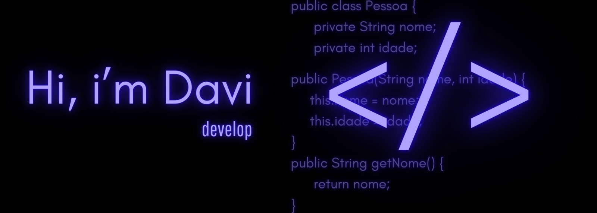

    
&nbsp;&nbsp;&nbsp; 
   
&nbsp;&nbsp;&nbsp; 

Eu desenvolvo soluções web inovadoras.    Graduando em Análise e Desenvolvimento de Sistemas, com conhecimento em <strong>HTML, CSS, JavaScript, Java e Mysql</strong>. Sou apaixonado por criar experiências inovadoras com tecnologia e desenvolver <strong>soluções inteligentes e de alta qualidade </strong> que atendam às necessidades do usuário. 

 
## My Skills

### Programação e Desenvolvimento:

 
    
    
    
    
    
      
    
    
    
    

 

### Ferramentas de design:

&nbsp;
&nbsp;
&nbsp;

### Ferramentas da estação de trabalho:

&nbsp;
&nbsp;
&nbsp;
&nbsp;

&nbsp;
&nbsp;

## Contacts:

 

  

&nbsp;
&nbsp;

Estou confiante de que posso contribuir para transformar seu projeto em realidade!

